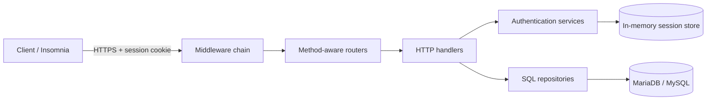

# Student Management API

A secure, dependency-light REST API for managing students, teachers, and executive users. Built with Go's standard `net/http` router, MariaDB/MySQL, Argon2id password hashing, and server-side cookie sessions.

The project demonstrates practical backend engineering patterns: reflection-driven SQL generation, bulk operations, transactional updates, filtering and sorting, authentication middleware, login throttling, secure response models, and layered HTTP/database code.

## Highlights

- Student, teacher, and executive CRUD endpoints
- Bulk create, patch, and delete operations
- Parameterized SQL queries
- Filtering and multi-field sorting
- Teacher-to-student lookup and student-risk endpoints
- Argon2id password hashing with unique salts
- Opaque server-side sessions
- Secure, HTTP-only authentication cookies
- Login throttling by username and IP address
- Authentication middleware on protected resources
- CORS, security headers, compression, response timing, HPP protection, and global rate limiting
- HTTPS using a local TLS certificate
- Unit and race-detector coverage for authentication-sensitive code

## Technology

| Area | Technology |
| --- | --- |
| Language | Go 1.26 |
| HTTP | Standard library `net/http` |
| Database | MariaDB or MySQL |
| Driver | `go-sql-driver/mysql` |
| Password hashing | Argon2id via `golang.org/x/crypto` |
| Configuration | Environment variables and `godotenv` |
| Authentication | Opaque server-side sessions and secure cookies |

## Architecture



```text
student-management-api/
├── cmd/api/                         # Application entry point
├── internal/
│   ├── api/
│   │   ├── handlers/                # Request validation and responses
│   │   ├── middleware/              # Auth, CORS, rate limits, HPP, etc.
│   │   └── router/                  # Route registration
│   ├── auth/                        # Passwords, sessions, login limiter
│   ├── models/                      # API and database models
│   └── repositories/sql-connect/   # SQL generation and persistence
├── pkg/utils/                       # Shared error utilities
├── cert.pem                         # Development TLS certificate
├── key.pem                          # Development TLS private key
├── go.mod
└── README.md
```

## Getting started

### Prerequisites

- Go 1.26 or a compatible newer version
- MariaDB or MySQL
- Git
- An API client such as Insomnia, Postman, or `curl`

### 1. Clone the repository

```bash
git clone https://github.com/Pratiksable/student-management.git
cd student-management
```

If your GitHub repository uses a different name, adjust the clone URL and directory accordingly.

### 2. Install dependencies

```bash
go mod download
```

### 3. Configure the environment

Create a `.env` file in the project root:

```dotenv
SERVER_PORT=3000

DB_USER=student_api
DB_PASSWORD=replace-with-a-strong-password
HOST=127.0.0.1
DB_PORT=3306
DB_NAME=student_management
```

Do not commit real credentials or production secrets.

### 4. Prepare the database

The API expects `students`, `teachers`, and `execs` tables. A minimal development schema is:

```sql
CREATE DATABASE IF NOT EXISTS student_management;
USE student_management;

CREATE TABLE students (
    id INT AUTO_INCREMENT PRIMARY KEY,
    first_name VARCHAR(100) NOT NULL,
    last_name VARCHAR(100) NOT NULL,
    email VARCHAR(255) NOT NULL UNIQUE,
    class VARCHAR(100) NOT NULL
);

CREATE TABLE teachers (
    id INT AUTO_INCREMENT PRIMARY KEY,
    first_name VARCHAR(100) NOT NULL,
    last_name VARCHAR(100) NOT NULL,
    email VARCHAR(255) NOT NULL UNIQUE,
    class VARCHAR(100) NOT NULL,
    subject VARCHAR(100) NOT NULL
);

CREATE TABLE execs (
    id INT AUTO_INCREMENT PRIMARY KEY,
    first_name VARCHAR(100) NOT NULL,
    last_name VARCHAR(100) NOT NULL,
    email VARCHAR(255) NOT NULL UNIQUE,
    username VARCHAR(100) NOT NULL UNIQUE,
    password VARCHAR(512) NOT NULL,
    password_changed_at DATETIME NULL,
    user_created_at DATETIME NULL DEFAULT CURRENT_TIMESTAMP,
    password_reset_code VARCHAR(255) NULL,
    password_code_expires_at DATETIME NULL,
    inactive BOOLEAN NOT NULL DEFAULT FALSE,
    role VARCHAR(50) NOT NULL
);
```

Adjust constraints and column sizes to match your deployment requirements.

### 5. Start the API

```bash
go run ./cmd/api
```

The server starts with TLS:

```text
https://localhost:3000
```

The checked-in certificate is intended for local development. Browsers and API clients may warn because it is not signed by a trusted certificate authority. In Insomnia, disable certificate validation only for local development.

## First administrator bootstrap

All CRUD resources—including `POST /execs`—are protected. A fresh database therefore needs one initial executive account before normal login can work.

For local development only, temporarily change `POST /execs` in `internal/api/router/execs_router.go` from the authenticated handler to:

```go
mux.HandleFunc("POST /execs", handlers.AddManyExecHandler)
```

Start the API and create the first account:

```json
[
  {
    "first_name": "Admin",
    "last_name": "User",
    "email": "admin@example.com",
    "username": "admin",
    "password": "replace-this-password",
    "role": "admin"
  }
]
```

Immediately restore the authenticated route afterward:

```go
mux.Handle(
    "POST /execs",
    requireAuth(http.HandlerFunc(handlers.AddManyExecHandler)),
)
```

Never expose executive registration publicly in production. A dedicated one-time bootstrap command or deployment seed is recommended for production environments.

## Authentication

### Login

Login accepts one JSON object—not an array:

```http
POST /execs/login
Content-Type: application/json
```

```json
{
  "username": "admin",
  "password": "replace-this-password"
}
```

Successful response:

```json
{
  "status": "success",
  "data": {
    "id": 1,
    "first_name": "Admin",
    "last_name": "User",
    "email": "admin@example.com",
    "username": "admin",
    "password_changed_at": null,
    "user_created_at": null,
    "password_code_expires_at": null,
    "inactive": false,
    "role": "admin"
  }
}
```

The response sets a cookie named `session` with these protections:

- `HttpOnly`: JavaScript cannot read it.
- `Secure`: it is sent only over HTTPS.
- `SameSite=Lax`: reduces cross-site request risks.
- `Path=/`: it applies to all API routes.
- 24-hour expiration.

Insomnia normally retains and sends the cookie automatically. With `curl`, use a cookie jar:

```bash
curl -k \
  -c cookies.txt \
  -H 'Content-Type: application/json' \
  -d '{"username":"admin","password":"replace-this-password"}' \
  https://localhost:3000/execs/login
```

Then call a protected route:

```bash
curl -k -b cookies.txt https://localhost:3000/students
```

### Logout

```bash
curl -k \
  -b cookies.txt \
  -c cookies.txt \
  -X POST \
  https://localhost:3000/execs/logout
```

Logout removes the server-side session and expires the browser cookie. Later protected requests return `401 Authentication required`.

### Login throttling

Failed login attempts are limited independently by normalized username and source IP. The current policy permits five failures in a 15-minute window. Successful authentication resets the counters.

## API endpoints

Except where marked public, every endpoint requires the `session` cookie.

### Authentication and executives

| Method | Endpoint | Authentication | Description |
| --- | --- | --- | --- |
| `POST` | `/execs/login` | Public | Authenticate and create a session |
| `POST` | `/execs/logout` | Required | Invalidate the current session |
| `GET` | `/execs` | Required | List executives |
| `POST` | `/execs` | Required | Create one or more executives |
| `PATCH` | `/execs` | Required | Bulk-update executives |
| `GET` | `/execs/{id}` | Required | Retrieve an executive |
| `PATCH` | `/execs/{id}` | Required | Update an executive |
| `DELETE` | `/execs/{id}` | Required | Delete an executive |
| `POST` | `/execs/{id}/updatepassword` | Required | Scaffolded; not fully implemented |
| `POST` | `/execs/forgotpassword` | Public | Scaffolded; not fully implemented |
| `POST` | `/execs/resetpassword/reset/{resetcode}` | Public | Scaffolded; not fully implemented |

Passwords cannot be changed through the generic PATCH endpoints. This prevents accidental plaintext password storage; password changes belong in the dedicated password endpoint.

### Students

| Method | Endpoint | Description |
| --- | --- | --- |
| `GET` | `/students` | List students |
| `POST` | `/students` | Create one or more students |
| `PATCH` | `/students` | Bulk-update students |
| `DELETE` | `/students` | Bulk-delete students |
| `GET` | `/students/{id}` | Retrieve a student |
| `PATCH` | `/students/{id}` | Update a student |
| `DELETE` | `/students/{id}` | Delete a student |
| `GET` | `/students/{id}/risk` | Calculate or retrieve student risk information |

Student creation accepts an array:

```json
[
  {
    "first_name": "Aarav",
    "last_name": "Patel",
    "email": "aarav@example.com",
    "class": "10A"
  }
]
```

### Teachers

| Method | Endpoint | Description |
| --- | --- | --- |
| `GET` | `/teachers` | List teachers |
| `POST` | `/teachers` | Create one or more teachers |
| `PATCH` | `/teachers` | Bulk-update teachers |
| `DELETE` | `/teachers` | Bulk-delete teachers |
| `GET` | `/teachers/{id}` | Retrieve a teacher |
| `PATCH` | `/teachers/{id}` | Update a teacher |
| `DELETE` | `/teachers/{id}` | Delete a teacher |
| `GET` | `/teachers/{id}/students` | List students in the teacher's class |
| `GET` | `/teachers/{id}/count` | Count students associated with the teacher |

Teacher creation also accepts an array:

```json
[
  {
    "first_name": "Priya",
    "last_name": "Sharma",
    "email": "priya@example.com",
    "class": "10A",
    "subject": "Mathematics"
  }
]
```

## Filtering and sorting

Collection endpoints support query parameters for filtering and sorting. Examples:

```http
GET /students?class=10A
GET /teachers?subject=Math
GET /teachers?sortby=last_name:asc&sortby=first_name:asc
```

Sorting only accepts allow-listed fields and the `asc` or `desc` direction, preventing raw query values from becoming SQL identifiers.

## Security design

- Passwords use Argon2id with a random 16-byte salt.
- Hashes store their algorithm version and cost parameters.
- Password comparisons use constant-time comparison.
- Passwords and reset codes are omitted from executive JSON responses.
- SQL values use placeholders instead of string interpolation.
- Session tokens contain 256 bits of cryptographic randomness.
- Only SHA-256 token digests are retained by the session store.
- Expired sessions are rejected and pruned.
- Authentication state is attached to request context by middleware.
- Unknown usernames and incorrect passwords receive the same `401` response.
- Login request bodies are size-limited, strict, and restricted to one JSON object.
- General and login-specific rate limiting reduce automated abuse.

### Current session limitation

Sessions are stored in memory. This is convenient for local development, but it means:

- Restarting the API logs everyone out.
- Multiple API instances do not share sessions.
- Deployments cannot revoke sessions across instances.

Use Redis or a database-backed session store before horizontally scaling the service.

## Testing

Run the complete suite:

```bash
go test ./...
```

Run authentication-sensitive packages with the race detector:

```bash
go test -race \
  ./internal/auth \
  ./internal/api/handlers \
  ./internal/api/middleware
```

Format and perform basic static analysis:

```bash
go fmt ./...
go vet ./...
```

Tests cover query generation, invalid patch fields, response secret removal, Argon2id hashing and verification, malformed hashes, session creation and expiration, authentication middleware, secure cookies, logout, and login throttling.

## Roadmap

- [ ] Replace in-memory sessions with Redis or database storage
- [ ] Add a safe first-administrator bootstrap command
- [ ] Implement password change, recovery, and reset flows
- [ ] Add role-based authorization, not only authentication
- [ ] Add database migrations
- [ ] Add structured application and security-event logging
- [ ] Add OpenAPI documentation
- [ ] Add integration tests using a disposable database
- [ ] Add CI for tests, race detection, and linting

## Contributing

Contributions are welcome.

1. Fork the repository.
2. Create a focused branch: `git checkout -b feature/my-change`.
3. Add tests for behavioral changes.
4. Run `go test ./...` and `go vet ./...`.
5. Commit with a clear message.
6. Open a pull request describing the problem and solution.

Please do not include credentials, production certificates, database dumps, or session tokens in commits or pull requests.

## License

Released under the [MIT License](LICENSE).

---

Built with Go, MariaDB, and a healthy respect for secure defaults.
